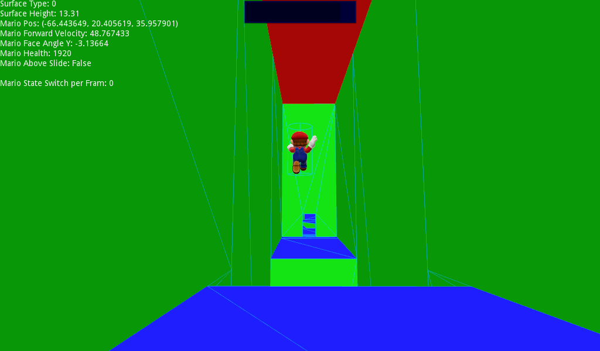
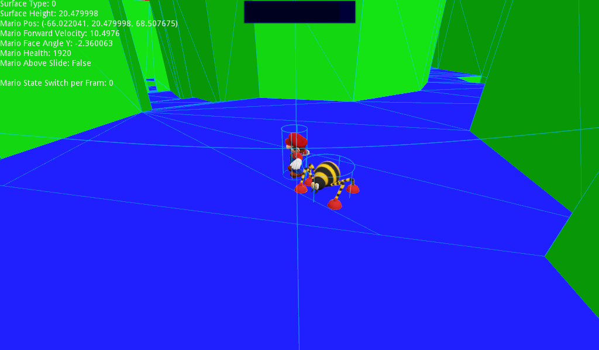
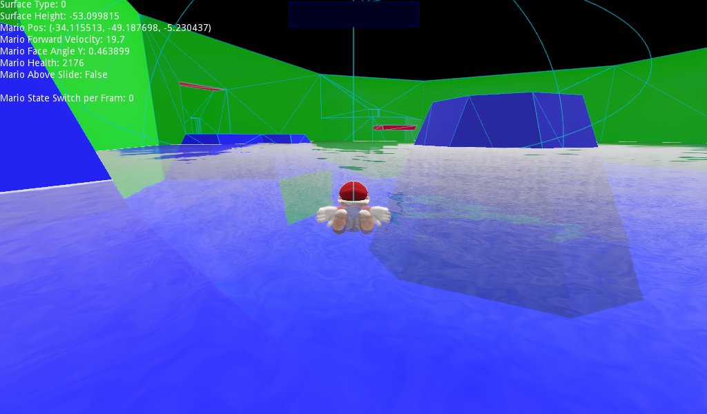
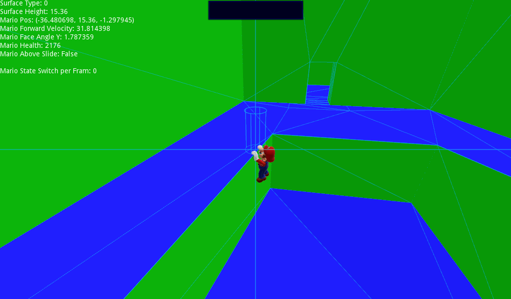

# SM64-recreated-in-Godot

This is Godot project of a recreation of the infamous Super Mario 64. More specifically, one of its levels, Hazy Maze Cave. It is _very much_ work in progress, so any code or resource contribution is welcome.

To move about you use the arrow keys (I have no controller to test with). To compensate for the lack of a control stick, scrolling the middle mouse will slow down, or speed up Mario. There's no cap.

The A button is the X key.

The B button is the Z key.

The Z button is the Shift key.

You can turn the camera with the A and D keys.

You can also take a screenshot with F2.

For testing purposes, the Q key allows you to jump indefinitely with the Q key.

